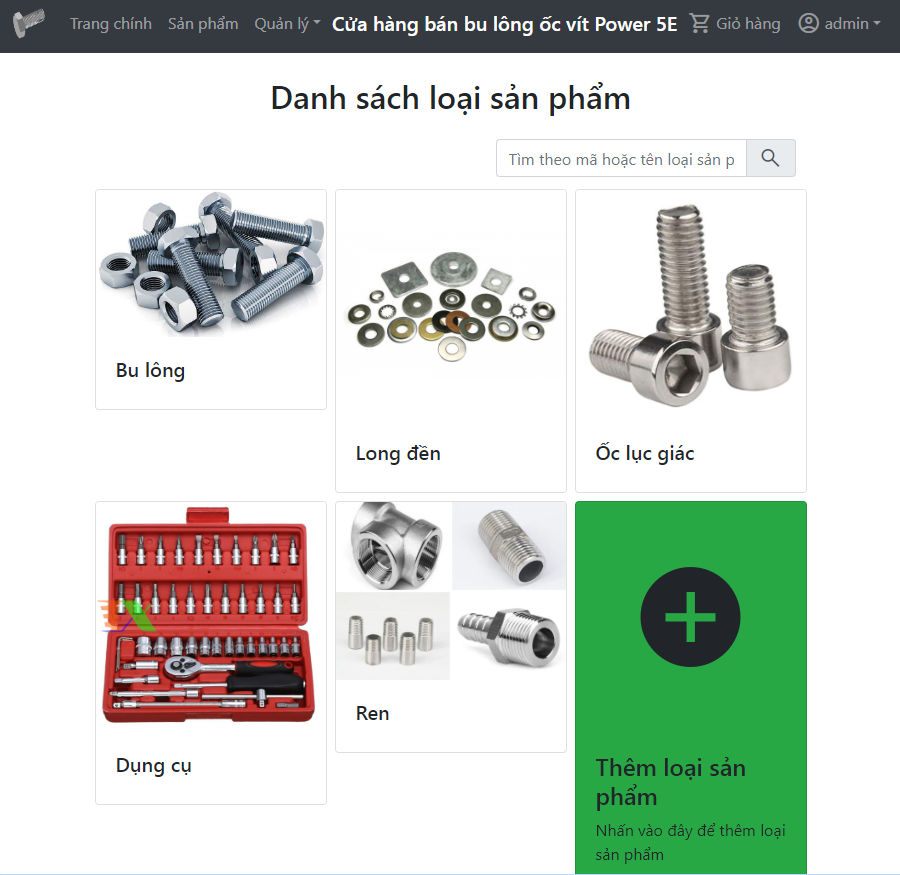

# QLyOcVit1

Xây dựng web quản lý bán ốc vít.

Đây là một dự án trường.

## Công nghệ
- HTML, CSS, JS, Bootstrap 4, jQuery
- C#, ASP.NET (Web Form)

## Các chức năng
+ Mua bán ốc vít, lập hoá đơn
+ Giỏ hàng
+ Quản lý sản phẩm, loại sản phẩm, thông tin khách hàng, nhân viên

## Setup
1. Tải bằng cách chạy lệnh clone hoặc tải bằng ZIP.
2. Mở file `.sln` bằng Visual Studio.
3. Bật SQL Server và kéo thả file `.sql` vào SQL Server và chạy lệnh bằng nút `F5`.
4. Về lại Visual Studio, chạy ứng dụng web bằng cách nhấn `F5`.

## Thư viện ảnh
Xem ở thư mục <a href="screenshots">screenshots</a>.
